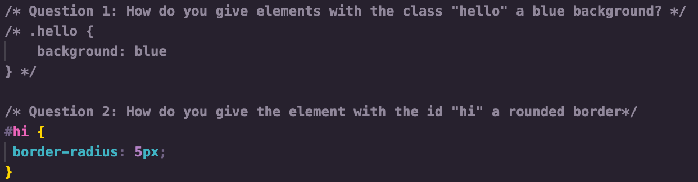

### Question 01: 
Within this folder is a style.css file and an index.html file. The style.css file contains 5 questions that will require you to write code using CSS selectors. In order to complete each question you may just comment out your answer to the previous question example: 

You CANNOT use any classes or IDs to do this nor may you make changes to the index.html.

### Your answers will go in the style.css file

FEEDBACK: Great job!!!
100%